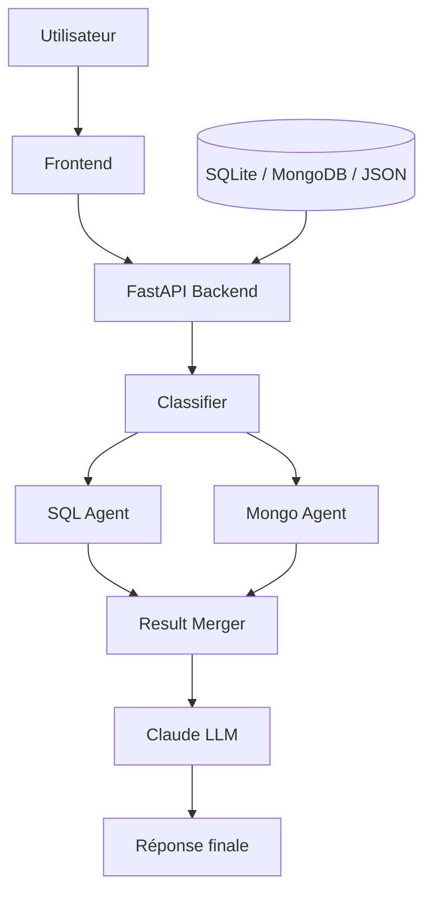

# DataTalk — données, RAG, Claude et interface

## Vue d'ensemble

DataTalk est une preuve de concept d'un système de requêtes en langage naturel sur plusieurs sources de données. Le projet combine :

- une base SQLite ;
- des exports MongoDB ;
- de la documentation technique JSON ;
- des correspondances SQL ↔ MongoDB ;
- un pipeline RAG pour rechercher les informations utiles ;
- un agent LLM Claude pour synthétiser la réponse finale.

## Configuration rapide

1. Copier `.env.example` vers `.env`.
2. Renseigner `CLAUDE_API_KEY`.
3. Vérifier `CLAUDE_MODEL` si nécessaire.
4. Installer les dépendances : `pip install -r requirements.txt`.
5. Lancer MongoDB localement si vous utilisez une base MongoDB.
6. Définir `MONGO_URI` et `MONGO_DB` dans le fichier `.env`.

## Variables d'environnement

Le projet attend les variables suivantes dans le fichier `.env` à la racine :

```env
CLAUDE_API_KEY=your_key_here
CLAUDE_MODEL=claude-sonnet-5
MONGO_URI=mongodb://localhost:27017
MONGO_DB=datatalk
```

La clé API doit être stockée dans `.env`, jamais dans le code ni dans le dépôt Git.

## Claude

Les agents utilisent `claude_generate()` dans `backend/llm.py`. Par défaut, le modèle est `claude-sonnet-5`, configurable via `CLAUDE_MODEL`.

## Uploads depuis le frontend

L'interface accepte :
- une base SQLite `.db`, `.sqlite` ou `.sqlite3` ;
- un export JSON MongoDB de la forme `{ "collection": [{...}, {...}] }` ;
- la documentation SQLite JSON ;
- la documentation MongoDB JSON ;
- `mappings.json` pour les correspondances SQL ↔ MongoDB.

La documentation et les mappings sont rechargés / indexés après upload.

## API FastAPI

Le backend expose une API FastAPI via `backend/main.py`.

Principaux endpoints :
- `GET /health`
- `GET /status`
- `POST /ask`
- `/upload/...` selon le flux d'ingestion

## Important

- Ne jamais committer `.env` ni la clé Claude.
- Le `.gitignore` doit exclure les secrets et les fichiers générés.

## Description du travail effectué

Ce dépôt contient une preuve de concept d'un pipeline RAG (Retrieval-Augmented Generation) associé à une interface minimale pour interroger des données multiples. La pile couvre :

- **Ingestion et catalogage :** chargement de sources SQL/NoSQL et indexation de la documentation.
- **Génération d'embeddings & retrieval :** règles de vectorisation et recherche dans le catalogue documentaire.
- **Agents spécialisés :** classification, génération SQL, génération MongoDB, planification de jointures, fusion des résultats.
- **Synthèse LLM :** réponse finale rédigée en français à partir des données récupérées.
- **Front-end :** interface légère pour uploader les données et lancer des requêtes.

## Détails des modules

- **`backend/` :** orchestration globale et API FastAPI.
- **`backend/llm.py` :** wrapper Anthropic / Claude partagé par les agents.
- **`backend/graph.py` :** graphe central d'exécution et logique de routage.
- **`backend/rag/embeddings.py` :** génération d'embeddings.
- **`backend/rag/retriever.py` :** recherche vectorielle sur le catalogue.
- **`backend/agents/` :**
  - `classifier.py` : décide si la question relève de SQL, MongoDB ou hybride.
  - `sql_agent.py` : génère et exécute une requête SQL en lecture seule.
  - `mongo_agent.py` : génère et exécute un pipeline MongoDB.
  - `join_planner.py` : prépare la jointure entre résultats SQL et MongoDB.
  - `result_merger.py` : fusionne les résultats et construit la réponse finale.
- **`backend/tools/` :** utilitaires SQLite, MongoDB, catalogue et RAG.
- **`data/` :** schémas documentés et mappings de correspondance.
- **`frontend/` :** interface utilisateur minimale.

## Schéma d'architecture



## Lancement local

Depuis le dossier `datatalk` :

```bash
pip install -r requirements.txt
copy .env.example .env
# puis compléter la clé Claude dans .env
python -m uvicorn backend.main:app --reload
```

## Vérification du gitignore

Le `.gitignore` du projet doit exclure :
- les variables d'environnement (`.env`, `.env.*`),
- les environnements virtuels (`venv/`, `.venv/`),
- les fichiers Python générés (`__pycache__/`, `*.pyc`),
- les bases de données locales (`*.db`, `*.sqlite`, `*.sqlite3`),
- les dépendances frontend (`node_modules/`).

C’est bien le cas après mise à jour.
